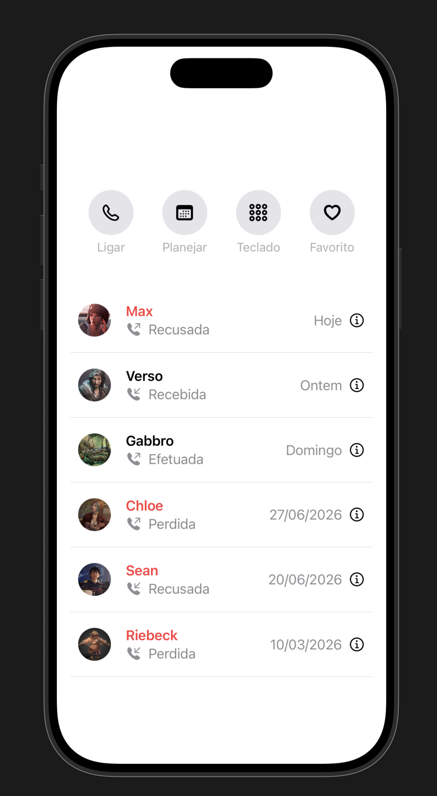

> **EN:** SwiftUI app simulating a call history with reusable views (`Ligacoes`, `btn`) composed on a single screen. Built in Xcode.
>
> *The rest of this README is in Brazilian Portuguese (pt-BR).*

---

# Histórico de Ligações (SwiftUI)

App desenvolvido em **SwiftUI** para simular uma interface de histórico de chamadas telefônicas. O projeto foca no conceito de **componentização e reutilização de views**, onde cada linha de registro e cada botão de ação funcionam de forma genérica e dinâmica com base nos parâmetros recebidos.

## Status

**Concluído** — Layout estruturado, componentes isolados e lógica de validação de chamadas implementada.

## Em que consiste

O projeto é construído sobre três pilares principais dentro de `ContentView.swift`:

- **`btn`** — Componente vertical reutilizável que gera botões de ação rápida. Recebe um ícone nativo do iOS (`SF Symbols`) e um texto descritivo, aplicando estilização de fundo circular cinza.
- **`Ligacoes`** — Linha de histórico customizável que gerencia estados complexos de chamadas. Ela recebe a foto de perfil (`Image`), nome do contato, data/hora e três flags booleanas (`efetuada`, `perdida`, `recusada`).
- **`ContentView`** — A tela principal que consome os componentes. Organiza o menu superior com espaçamento adequado e empilha o histórico usando divisores (`Divider`), simulando a listagem real do ecossistema Apple.

### Lógica de Validação (`verificarChamada`)
Dentro do componente `Ligacoes`, existe uma função que analisa os booleanos para determinar dinamicamente o texto descritivo e a cor do nome do contato:
* Se `perdida` for `true`, o nome do contato fica **vermelho**.
* A combinação das flags gera textualmente os estados: *Recusada*, *Perdida*, *Efetuada* ou *Recebida*.

## Como executar

### Pré-requisitos
* macOS Monterey (ou superior)
* Xcode 13+
* iOS SDK 15+

### Passo a passo
1. Clone este repositório ou copie os arquivos para um projeto SwiftUI no Xcode.
2. Certifique-se de ter as imagens correspondentes no seu `Assets.xcassets` (`max.icon`, `verso.icon`, etc.).
3. Abra o projeto no Xcode.
4. Use o **Canvas/Preview** do Xcode (`⌥ + ⌘ + P`) para visualizar em tempo real ou execute (`⌘ + R`) no Simulador.

## Preview da Interface

  

